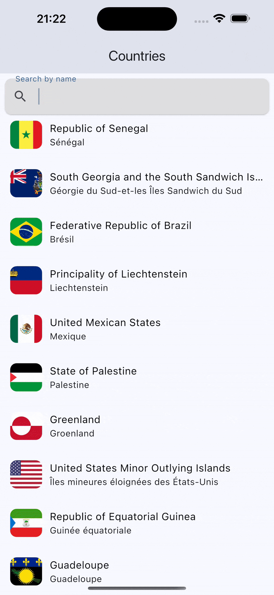
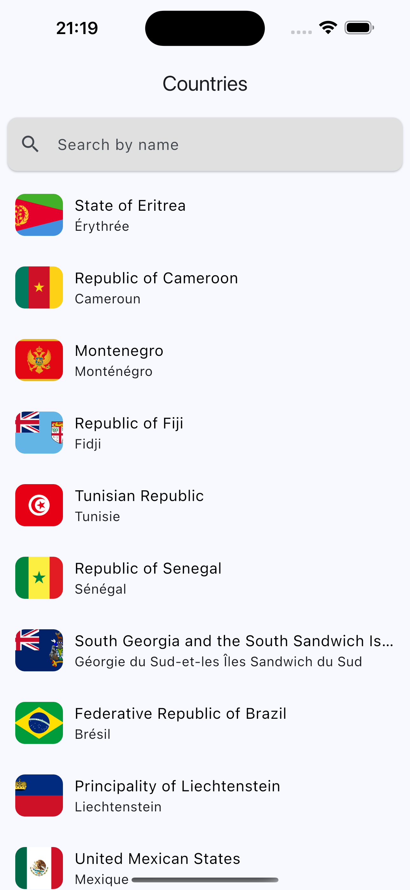
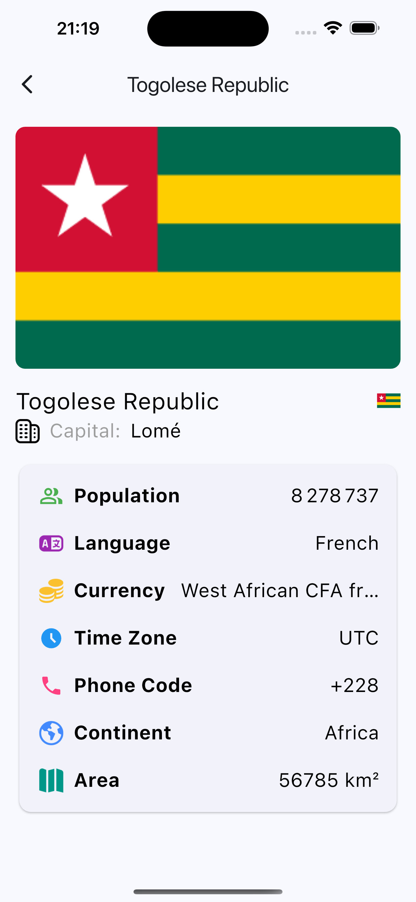

# 🌍 World Tour UI

**World Tour UI** is a Flutter application built from scratch to train and improve Flutter development skills.  
It features a minimalist and modern user interface that simulates a travel or world tour browsing experience.

---

## 🎥 Preview



---

## 📸 Screenshots

| Home | Details |
|------------|-----------------|
|  |  |

---

## ✨ Features

- Minimalist and modern travel-themed UI
- Smooth layout and clean navigation
- Scalable project structure (ready for feature expansion)

---

## 🧰 Tech Stack

- [Flutter][flutter] (latest stable version)
- **Dart** (included with Flutter)
- No external UI templates — all designed from scratch


[flutter]: https://flutter.dev/docs/get-started/install

---

## 🚀 Getting Started

1. **Clone the repository**  
   git clone https://github.com/Kenneth-Anthony-G/world-tour.git  
   cd world_tour_ui

2. **Install dependencies**  
   flutter pub get

3. **Run the project**  
   flutter run

---

## 📁 Project Structure
```
lib/  
├── main.dart  
├── screens/  
│   └── home_screen.dart  
├── widgets/  
│   └── ...  
└── models/  
└── ... 
```

---

## 📌 Notes

- This is version **1.0** of the UI. Future updates may include animations, state management, and real data integration.
- Built entirely from scratch — no Dribbble or UI kits used.

---

## 📬 Contact

For feedback or questions:  
**anthonyedem46@gmail.com**
